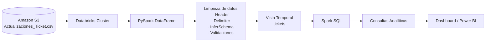

# AWS S3 + Databricks + PySpark ETL Pipeline

## Descripción

Proyecto de ingeniería de datos donde se realiza la lectura de un archivo CSV almacenado en Amazon S3 utilizando Databricks.

Posteriormente se realizan procesos de limpieza con PySpark y análisis mediante Spark SQL.

## Arquitectura

S3
↓
Databricks
↓
PySpark
↓
Spark SQL

## Tecnologías

- AWS S3
- Databricks
- Apache Spark
- PySpark
- Spark SQL

## Proceso

### 1. Lectura desde S3

```python
spark.read.csv(...)
```

### 2. Limpieza

- Eliminación de duplicados
- Conversión de fechas
- Renombrado de columnas

### 3. Creación de vista SQL

```python
df.createOrReplaceTempView("tickets")
```

### 4. Consultas

```sql
%sql
SELECT
    `Tipo de ticket`,
    COUNT(*) AS total_tickets
FROM tickets
GROUP BY `Tipo de ticket`
ORDER BY total_tickets DESC;
```

## Resultados

- Conteo de tickets
- Tickets por día
- Tickets por tipo
- Consultas analíticas
## Arquitectura del Proyecto


## 👨‍💻 Author

Leonardo Martín Angulo Mogollón

Data Analyst | Business Intelligence | Databricks Certified
